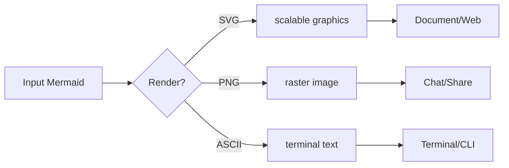

# Pretty Mermaid Skills — Quick Reference

**โครงการ**: Pretty Mermaid Skill (github.com/imxv/Pretty-mermaid-skills)  
**เวอร์ชัน**: 1.0.0  
**ข้อกำหนด**: Node.js 16+

---

## ✨ คืออะไร

**Pretty Mermaid** คือ skill/CLI tool สำหรับ render diagram ประเภท Mermaid ลงในเครื่องเองโดยไม่ต้องใช้ browser หรือ DOM

ทำให้ diagram ที่สร้างมาจากโค้ด Mermaid เปลี่ยนเป็นผลลัพธ์ 3 รูปแบบ:
- **SVG** — scalable graphics สำหรับ documentation และ web
- **PNG** — raster format สำหรับแชร์และ chat
- **ASCII/Unicode** — terminal-ready text art

ออกแบบมาให้ใช้กับ AI agents (Claude Code, Cursor, Codex, Gemini CLI ฯลฯ)

---

## 📦 การติดตั้ง

### วิธีมาตรฐาน (Global Skill)
```bash
npx skills add imxv/pretty-mermaid-skills@pretty-mermaid -g -y
```

### ตรวจสอบการติดตั้ง
```bash
npx skills list -g
```
ต้องเห็น `pretty-mermaid` ในลิสต์ที่ปรากฏ

---

## 🎯 ประเภท Diagram ที่รองรับ (6 types)

| ประเภท | ใช้เมื่อ | Starter syntax |
|--------|---------|----------------|
| **Flowchart** | กระบวนการ, decision tree, architecture | `flowchart LR` |
| **Sequence** | API calls, messages, interactions | `sequenceDiagram` |
| **State** | Lifecycle, finite-state machine | `stateDiagram-v2` |
| **Class** | Classes, modules, relationships | `classDiagram` |
| **ER** | Database entities, cardinality | `erDiagram` |
| **XY Chart** | Bars, lines, trends, comparisons | `xychart-beta` |

---

## 🎨 Themes ที่มี (15 themes)

### Light Themes
- `zinc-light` — neutral สำหรับพิมพ์และ documentation
- `tokyo-night-light` — soft colors
- `catppuccin-latte` — warm pastels
- `github-light` — GitHub style light
- `solarized-light` — solarized palette

### Dark Themes
- `zinc-dark` — neutral dark
- `tokyo-night` — popular dark (ขอแนะนำสำหรับ docs)
- `github-dark` — GitHub style dark
- `catppuccin-mocha` — warm dark
- `solarized-dark` — solarized dark

### Other
- `nord`, `nord-light` — cool, restrained palette
- `dracula` — high-contrast colors
- `one-dark` — Atom One Dark style

---

## ⚙️ Script หลัก (Core Scripts)

### 1. แสดง themes ทั้งหมด
```bash
node scripts/themes.mjs
```

### 2. Render SVG (single diagram)
```bash
node scripts/render.mjs \
  --input diagram.mmd \
  --output diagram.svg \
  --theme tokyo-night
```

### 3. Render PNG
```bash
node scripts/render.mjs \
  --input diagram.mmd \
  --output diagram.png \
  --format png \
  --width 1200 \
  --theme tokyo-night
```

### 4. Render Terminal ASCII/Unicode
```bash
node scripts/render.mjs \
  --input diagram.mmd \
  --output diagram.txt \
  --format ascii \
  --color-mode none
```

ใช้ `--use-ascii` เมื่อ Unicode box-drawing ไม่รองรับ

### 5. Batch Render (directory)
```bash
node scripts/batch.mjs \
  --input-dir ./diagrams \
  --output-dir ./rendered \
  --format svg \
  --theme github-dark \
  --workers 4
```

ใช้เมื่อต้อง render 3+ diagrams พร้อมกัน หรือต้องใช้ตัวเลือก unified

---

## 📋 ตัวเลือก Common Options

### Styling (ทั่วไป)
```
--theme <name>        # Apply built-in theme
--bg, --fg           # Set base colors (hex values)
--line, --accent     # Refine connectors & highlights
--muted, --surface   # Secondary colors & fills
--border             # Node stroke color
--font <name>        # SVG font family
```

### SVG specific
```
--transparent        # Remove background
--padding <n>        # Canvas padding
--node-spacing <n>   # Horizontal spacing (ELK layout)
--layer-spacing <n>  # Vertical spacing
--component-spacing  # Disconnect component separation
--interactive        # XY chart tooltips
```

### PNG specific
```
--width <n>          # Output width (100–10000 px)
--transparent        # Keep transparent background
```

### Terminal specific
```
--use-ascii          # Plain ASCII instead of Unicode
--padding-x, -y      # Diagram spacing
--box-border-padding # Node interior padding
--color-mode <mode>  # none|auto|ansi16|ansi256|truecolor|html
```

---

## 🚀 Usage Patterns (กรณีทั่วไป)

### Pattern 1: Single SVG for Documentation
```bash
node scripts/render.mjs \
  --input flow.mmd \
  --output diagram.svg \
  --theme github-light
```

### Pattern 2: High-Res PNG for Sharing
```bash
node scripts/render.mjs \
  --input flow.mmd \
  --output diagram.png \
  --format png \
  --width 1920 \
  --theme dracula
```

### Pattern 3: Terminal-Friendly Text
```bash
node scripts/render.mjs \
  --input flow.mmd \
  --output diagram.txt \
  --format ascii \
  --color-mode ansi256
```

### Pattern 4: Batch Convert Diagrams
```bash
node scripts/batch.mjs \
  --input-dir ./diagrams \
  --output-dir ./dist \
  --format svg \
  --theme tokyo-night \
  --workers 4
```

### Pattern 5: Custom Colors
```bash
node scripts/render.mjs \
  --input flow.mmd \
  --output diagram.svg \
  --bg "#1a1a2e" \
  --fg "#eaeaea" \
  --accent "#00d4ff" \
  --line "#888888"
```

---

## 📂 Directory Structure

```
├── scripts/
│   ├── render.mjs           ← Single diagram render
│   ├── batch.mjs            ← Batch render directory
│   ├── themes.mjs           ← List themes
│   └── [helpers]
├── assets/
│   ├── example_diagrams/    ← Templates (6 types)
│   └── theme_gallery/       ← Gallery SVGs (all 15 themes)
├── references/
│   ├── DIAGRAM_TYPES.md     ← Mermaid syntax reference
│   ├── THEMES.md            ← Theme colors & customization
│   └── api_reference.md     ← beautiful-mermaid API
├── docs/
│   └── THEME_GALLERY.md     ← Visual theme comparison
├── SKILL.md                 ← Full skill documentation
└── package.json
```

---

## 📚 Resources ที่สำคัญ

| ไฟล์ | ใช้เมื่อ |
|-----|--------|
| `references/DIAGRAM_TYPES.md` | เขียน Mermaid syntax หรือ debug |
| `references/THEMES.md` | เลือก theme หรือ custom colors |
| `references/api_reference.md` | Extend scripts หรือใช้ API โดยตรง |
| `docs/THEME_GALLERY.md` | เปรียบเทียบ themes เชิงวิジ่ว |
| `assets/example_diagrams/` | Template สำหรับแต่ละ diagram type |

---

## ✅ Validation Checklist

หลัง render ต้องตรวจสอบ:
1. ✓ Command exit successfully (exit code 0)
2. ✓ Output file ไม่ว่าง
3. ✓ SVG/PNG/TXT เปิดได้ถูกต้อง
4. ✓ Arrows, labels, cardinalities ตรงกับ source
5. ✓ Layout readable (ไม่ crowded หรือ clipped)
6. ✓ CJK text และ unicode แสดงถูก

---

## 🔧 Troubleshooting

| ปัญหา | วิธีแก้ |
|-------|--------|
| Missing dependency | `npm install` ที่ skill root |
| Unknown theme | `node scripts/themes.mjs` → ใช้ชื่อที่อยู่ในลิสต์ |
| Parse error | ดู `references/DIAGRAM_TYPES.md`, ลดเหลือ failing statement |
| Crowded SVG | เพิ่ม `--node-spacing`, `--layer-spacing`, หรือ `--component-spacing` |
| PNG color error | ใช้ hex colors (#rrggbb) แทน CSS variables |
| ANSI escape codes ในลิสต์ | `--color-mode none` เมื่อ redirect output |

---

## 🔗 Dependencies

- `@resvg/resvg-js` ^2.6.2 — SVG to PNG renderer
- `beautiful-mermaid` ^1.1.3 — Core rendering engine (Mermaid + theming)

---

## 📝 Example Diagram (Flowchart)



Render ด้วย:
```bash
node scripts/render.mjs \
  --input example.mmd \
  --output example.svg \
  --theme tokyo-night
```

---

## 📞 หากต้องการเพิ่มเติม

- **Skill full docs**: `SKILL.md`
- **Contributing**: `CONTRIBUTING.md`
- **Security**: `SECURITY.md`
- **Changelog**: `CHANGELOG.md`
- **Repository**: github.com/imxv/Pretty-mermaid-skills
- **Skills.sh page**: skills.sh/imxv/pretty-mermaid-skills/pretty-mermaid

---

**Last updated**: 2026-09-14 | **Pretty Mermaid v1.0.0**
